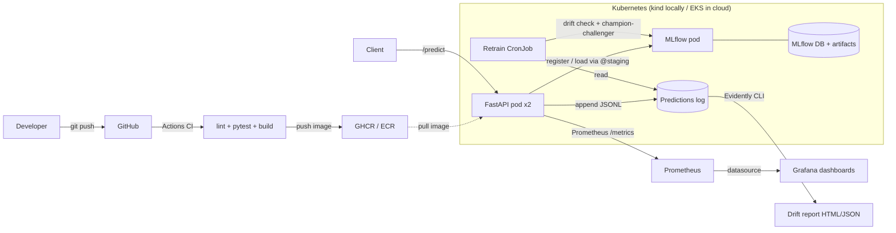

# Predictive Maintenance MLOps Pipeline


End-to-end MLOps pipeline for predicting industrial machine failure from sensor data.
The model is a placeholder — the **production loop** (train → serve → containerize → deploy
→ monitor → auto-retrain) is the deliverable.

## Architecture



The arrows that *close the loop*: the API appends predictions to a log, the
scheduled retrain job reads that log, compares the live distribution to the
training distribution via Evidently, trains a challenger, and only re-points
`@staging` if the challenger beats the current champion on F1. The API picks
up the new model on its next restart.

## Phase status

| # | Phase | Status |
|---|---|---|
| 0 | Repo + env setup | Done |
| 1 | Data + baseline model (XGBoost F1 = 0.768 on test) | Done |
| 2 | MLflow experiment tracking + registry | Done |
| 3 | FastAPI serving (`/health`, `/predict`) | Done |
| 4 | Docker + docker-compose (API + MLflow over HTTP) | Done |
| 5 | Kubernetes deploy on kind (manifests in `k8s/`) | Done |
| 6 | CI/CD via GitHub Actions → GHCR | Done |
| 7 | Prometheus + Grafana + Evidently drift reports | Done |
| 8 | Drift-triggered auto-retraining with champion-challenger gate | Done |
| 9 | Terraform IaC (EKS + ECR) + architecture diagram + demo | Code done; AWS apply pending |

> **DVC note:** intentionally deferred from Phase 2 to Phase 8. Versioning a single
> 522 KB static CSV is busywork; DVC earns its keep when the retrain loop starts
> producing new dataset snapshots.

## Dataset

**Source:** UCI Machine Learning Repository — AI4I 2020 Predictive Maintenance Dataset
https://archive.ics.uci.edu/dataset/601/ai4i+2020+predictive+maintenance+dataset

| Field | Value |
|---|---|
| File | `data/raw/ai4i2020.csv` |
| Rows | 10,000 |
| Size | 522,048 bytes |
| SHA-256 | `dc6630cd9b1f0f853922fad78a1b6436570d3f1ec863f1dd5c4340ac56bc8a8e` |
| Target | `Machine failure` (binary, ~3.4% positive class) |
| Sub-targets | TWF, HDF, PWF, OSF, RNF (failure-type labels) |

Verify with:

```bash
shasum -a 256 data/raw/ai4i2020.csv
```

## Repo layout

```
.
├── data/raw/             # immutable raw dataset (not versioned via DVC yet — see note above)
├── notebooks/            # EDA, scratch
├── src/
│   ├── data/             # loading, preprocessing
│   ├── training/         # training pipelines
│   └── serving/          # FastAPI app (Phase 3+)
├── tests/                # pytest
├── configs/              # hyperparams, env configs
├── requirements.txt
└── README.md
```

## Setup (Phase 0)

```bash
# 1. Create + activate venv
python3 -m venv .venv
source .venv/bin/activate

# 2. Install deps
pip install --upgrade pip
pip install -r requirements.txt

# 3. Sanity check
python -c "import pandas, sklearn, xgboost, imblearn, mlflow; print('OK')"
```

## MLflow (Phase 2)

Every training run logs to a local SQLite store (`mlflow.db`) — registry works
with SQLite but **not** with the default file backend.

```bash
# Train both models, register the winner under @staging
python -m src.training.train_baseline

# Browse experiments + registry in your browser (http://127.0.0.1:5000)
mlflow ui --backend-store-uri sqlite:///mlflow.db
```

The winning model is registered as `predictive_maintenance` and the
`@staging` alias is pointed at the new version. **Phase 3's FastAPI service
will load `models:/predictive_maintenance@staging`** — that handle stays
stable no matter how many times we retrain.

## Serving (Phase 3)

The FastAPI service loads the registered model through its `@staging` alias —
no file paths, no hardcoded version numbers. When the model is retrained and
the alias re-points (Phase 8), a server restart picks up the new model with
zero code change.

```bash
# Make sure Phase 2 was run at least once (creates mlflow.db + a registered model)
python -m src.training.train_baseline

# Launch the API
uvicorn src.serving.app:app --host 0.0.0.0 --port 8000 --reload
```

Then:

- **Swagger UI / try-it-yourself:** http://127.0.0.1:8000/docs
- **Liveness + model info:** `GET /health`
- **Prediction:** `POST /predict`

Sample request:

```bash
curl -X POST http://127.0.0.1:8000/predict \
  -H 'Content-Type: application/json' \
  -d '{
    "type": "L",
    "air_temp_k": 298.1,
    "process_temp_k": 308.6,
    "rot_speed_rpm": 1551,
    "torque_nm": 42.8,
    "tool_wear_min": 0
  }'
```

Configuration is env-var overridable (matters in Phase 4 Docker / Phase 5 K8s):
`MLFLOW_TRACKING_URI`, `MODEL_NAME`, `MODEL_ALIAS`, `DECISION_THRESHOLD`.

## Compose stack (Phase 4)

Two services: `mlflow` (tracking server, host port **5001** → container 5000)
and `api` (FastAPI, port 8000). The API container talks to MLflow over HTTP
at `http://mlflow:5000` (compose-internal hostname). Same pattern transfers
to K8s in Phase 5.

> **Why 5001?** macOS 12+ uses port 5000 for AirPlay Receiver. We remap on
> the host side; nothing inside the compose network changes.

```bash
# Build the API image + launch both services
docker compose up --build -d

# Tail logs (Ctrl+C to detach -- containers keep running)
docker compose logs -f api mlflow
```

**First-time setup**: the MLflow server starts empty, so the API will return
`status=degraded` until you train a model into it:

```bash
# Train against the running MLflow server. Host port is 5001 (not 5000) to
# avoid macOS AirPlay Receiver, which squats on 5000.
MLFLOW_TRACKING_URI=http://localhost:5001 \
  python -m src.training.train_baseline
```

After training, the model is registered into the *containerized* MLflow.
Restart the API so it picks up the new `@staging` alias:

```bash
docker compose restart api
curl -s http://127.0.0.1:8000/health | python -m json.tool
# MLflow UI at http://127.0.0.1:5001
```

Tear it down (volumes persist):

```bash
docker compose down
```

Wipe it (volumes too):

```bash
docker compose down -v
```

## Kubernetes (Phase 5)

Manifests live in `k8s/`: namespace, ConfigMap, MLflow (PVC + Deployment +
Service), API (Deployment + Service). All inside a `pdm` namespace so the
whole environment can be wiped with one command.

```bash
# 1. Create a local kind cluster
kind create cluster --name pdm

# 2. Build the API image (if compose hasn't already) and load it into kind.
#    Without this, kind can't find the local image.
docker compose build api
kind load docker-image predictive-maintenance-api:0.4.0 --name pdm

# 3. Apply the manifests
kubectl apply -f k8s/

# 4. Watch pods come up (MLflow first, then API)
kubectl get pods -n pdm -w
# Wait until both pods are Running and READY 1/1 (mlflow) or 2/2 (api).
# The API will be Running but NOT READY until a model is registered --
# that's the readiness probe doing its job.

# 5. Port-forward MLflow so you can train against it from your laptop
kubectl port-forward -n pdm svc/mlflow 5001:5000 &

# 6. Train. The model gets registered into the in-cluster MLflow.
MLFLOW_TRACKING_URI=http://localhost:5001 \
  python -m src.training.train_baseline

# 7. The API pods will pick up the new @staging alias on their next /ready
#    poll (within ~10s) and become Ready. You can verify:
kubectl get pods -n pdm

# 8. Port-forward the API and hit it
kubectl port-forward -n pdm svc/pdm-api 8000:8000 &
curl -s http://127.0.0.1:8000/health | python -m json.tool
curl -s -X POST http://127.0.0.1:8000/predict \
  -H 'Content-Type: application/json' \
  -d '{"type":"H","air_temp_k":302.5,"process_temp_k":313.0,"rot_speed_rpm":1300,"torque_nm":75.0,"tool_wear_min":220}' \
  | python -m json.tool
```

Tear down:

```bash
kubectl delete namespace pdm        # wipe just the app
kind delete cluster --name pdm      # wipe the whole cluster
```

## CI/CD (Phase 6)

A single GitHub Actions workflow (`.github/workflows/ci.yml`) runs on every
push and PR.

- **`lint-and-test`** (always) — ruff + pytest. PRs are blocked from merging
  until this passes.
- **`build-and-push`** (only on push to `main`) — builds the API Docker image
  and publishes to GHCR under two tags:
  - `ghcr.io/<owner>/predictive-maintenance-api:latest`
  - `ghcr.io/<owner>/predictive-maintenance-api:sha-<short-sha>`

The `sha-` tag is immutable (the bytes for `sha-abc1234` never change), so
deployments can pin to it and roll back precisely. `latest` is the convenient
"current main" pointer.

### Rolling the K8s API to a CI-built image

Once the workflow has run at least once and an image exists in GHCR:

```bash
# Find the latest sha tag at https://github.com/<owner>?tab=packages
kubectl set image deployment/pdm-api -n pdm \
  api=ghcr.io/<owner>/predictive-maintenance-api:sha-<short-sha>
kubectl rollout status deployment/pdm-api -n pdm
```

The deployment rolls; readiness probes gate traffic; if the new image breaks,
`kubectl rollout undo deployment/pdm-api -n pdm` reverts to the previous
working image in seconds.

## Monitoring + drift (Phase 7)

Compose now runs four services: `mlflow`, `api`, `prometheus`, `grafana`.

| Service | URL | Notes |
|---|---|---|
| API | http://localhost:8000 | `/metrics` exposes Prometheus exposition format |
| Prometheus | http://localhost:9090 | Scrapes `api:8000/metrics` every 10s |
| Grafana | http://localhost:3000 | login `admin` / `admin`; "Predictive Maintenance API" dashboard pre-provisioned |
| MLflow | http://localhost:5001 | unchanged |

Custom metrics emitted by the API:

- `pdm_predictions_total{model_version, prediction}` — counter
- `pdm_prediction_probability{model_version}` — histogram (10 buckets)

```bash
# Build the new 0.7.0 image + bring everything up
docker compose up --build -d

# Train against the running MLflow (same as Phase 4)
MLFLOW_TRACKING_URI=http://localhost:5001 \
  python -m src.training.train_baseline
docker compose restart api

# Drive traffic so dashboards have something to show
for i in $(seq 1 200); do
  curl -s -X POST http://localhost:8000/predict \
    -H 'Content-Type: application/json' \
    -d '{"type":"L","air_temp_k":298.1,"process_temp_k":308.6,"rot_speed_rpm":1551,"torque_nm":42.8,"tool_wear_min":0}' \
    > /dev/null
done

# Watch the panels light up
open http://localhost:3000
```

### Drift detection

Every prediction is appended to a JSONL log inside the `predictions_log` volume.
The drift script reads that log and compares the live input distribution to
the training distribution:

```bash
# Copy the log out of the container volume so the host script can read it
docker compose cp api:/var/log/pdm/predictions.jsonl data/predictions/predictions.jsonl

python -m src.monitoring.drift \
  --predictions data/predictions/predictions.jsonl \
  --out artifacts/drift

open artifacts/drift/drift_report.html
```

Phase 8 will wrap this script in a scheduled job: if drift exceeds a threshold,
retrain → register → re-point `@staging` → API picks up the new version on
next restart.

## Auto-retraining (Phase 8)

The orchestrator at `src/orchestrator/retrain.py` closes the MLOps loop:

```
prediction log -> drift check -> if drift, train challenger ->
  champion-challenger comparison -> promote only if challenger wins
```

```bash
# Run it manually. Reads data/predictions/predictions.jsonl (copy it out
# of the API container first, same as Phase 7).
python -m src.orchestrator.retrain

# Skip the drift gate -- always train a challenger
python -m src.orchestrator.retrain --force

# Require at least a 1% absolute F1 gain over the champion before promoting
python -m src.orchestrator.retrain --min-gain 0.01
```

Exit codes are how a scheduler (cron / GitHub Actions / Argo) decides whether
to alert: `0` no-op or promoted, `2` drift but no improvement, `3` training
failed, `4` no prediction log yet.

### What's auto and what's NOT (interview honesty)

What this pipeline auto-does: detect drift, train a challenger, compare F1
to the registered champion, promote only if better, persist a decision
record. What it doesn't do, and what a production version would add:

- **Shadow deployment** — serve the challenger alongside the champion on
  live traffic, compare without exposing users to the new model.
- **Statistical significance** — a single-shot F1 delta of 0.005 is noise.
  Real systems require multiple training seeds + a p-value, or a 5%+ gain.
- **Manual approval gate** — regulated domains require a human sign-off
  before any production model swap.
- **Time-based fallback** — scheduled retraining (e.g. weekly) regardless of
  drift, because covariate drift in inputs isn't the only failure mode.

### Scheduling

- **GitHub Actions (cloud-side):** `.github/workflows/retrain.yml` is set
  to `workflow_dispatch` (manual) until there's a hosted MLflow to point at.
  Uncomment the `schedule:` block to enable daily 07:00 UTC runs.
- **Kubernetes CronJob (in-cluster):** `k8s/cronjob.yaml` is written but NOT
  applied yet — see the TODO below.

## Cloud deployment (Phase 9)

See [`terraform/README.md`](./terraform/README.md) for the apply / destroy
workflow. Stack: VPC + EKS (1.31, t3.medium x2) + ECR. Demo cost: ~$1.

```bash
cd terraform
terraform init
terraform apply         # ~15 min
# ... push image, kubectl apply -f ../k8s/, port-forward, demo, screenshot ...
terraform destroy       # always run this
```

## Resume bullet

> **Predictive-Maintenance MLOps Pipeline** — built and deployed an end-to-end
> failure-prediction service on industrial sensor data (UCI AI4I): XGBoost
> classifier (F1 0.77 on minority class) tracked with MLflow Model Registry,
> served via FastAPI with liveness/readiness probes, containerized with Docker
> and deployed on Kubernetes (local `kind` and AWS EKS via Terraform), with
> GitHub Actions CI/CD publishing to GHCR + ECR, Prometheus + Grafana metrics,
> Evidently-based data-drift detection, and a drift-triggered champion-challenger
> retrain orchestrator that auto-promotes only when the new model beats the
> registered version on test F1.

## Final TODO

- [ ] Run the Terraform apply / EKS demo / destroy cycle (Phase 9 batch 2).
- [ ] Capture screenshots or a Loom video during the EKS demo for portfolio use.
- [ ] (Optional) Wire the K8s CronJob to a shared EFS PVC so it can actually
  read the API's prediction log in-cluster. Today it runs but uses an emptyDir.

## Conventions

- **Metric of record:** F1 on the minority class (failure). Accuracy is misleading on a
  ~3.4%-positive dataset.
- **Model registry:** MLflow Model Registry (Phase 2 onward). Don't commit `.pkl` files.
- **Reproducibility:** every training run logs params, metrics, and the dataset hash to MLflow.
